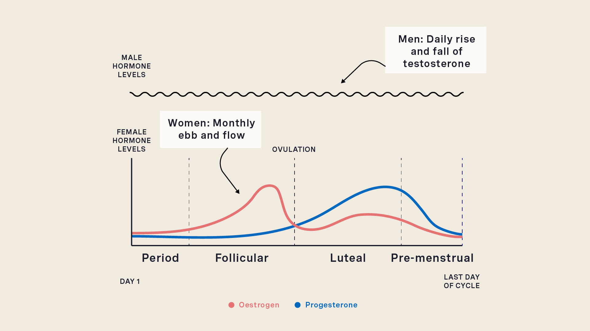

# MACS_Final

**Final Project for HPC Class**  
**Student: Summer Negahdar**

---

## 🎯 Project Topic  
**Designing a Pipeline for Daily Surveying, Hormonal Phase Categorization, and Personalized Recommendations**

---

## 🔍 Introduction

I am a founding team member of a fem-tech startup incubated at the University of Chicago Booth School of Business. Our application focuses on empowering women through personalized health insights aligned with their menstrual cycle phases.

Throughout the month, women experience natural hormonal fluctuations that affect not only physical health but also mood, focus, energy, appetite, and exercise performance. Our app aims to deliver **knowledge-based, cycle-specific** recommendations on:

- Diet & nutrition
- Exercise and activity
- Caffeine and alcohol intake
- Socialization patterns
- Mental focus and productivity

Understanding these shifts allows users to make more informed daily decisions, leading to better health and performance outcomes.

---

## 🚧 Current Stage

We are currently in the **early data collection phase**, aiming to assess how much women know about their cycles and how they feel throughout each phase. To support this effort, I have designed a cloud-based pipeline to:

1. Deliver daily surveys to beta users
2. Process and validate responses
3. Categorize each user into a hormonal phase
4. Deliver personalized recommendations

---

## 🧪 The Pipeline

The system consists of two main phases:

---

### 📤 Phase 1: Survey Distribution & Data Collection

Each day, a survey will be sent to users with the following six core questions:

---

**Q1: Do you currently have menstrual bleeding?**  
- 0 – No  
- 1 – Spotting  
- 2 – Light  
- 3 – Medium  
- 4 – Heavy  

---

**Q2: How would you rate your cervical mucus today?**  
- 0 – Dry  
- 1 – Sticky  
- 2 – Creamy  
- 3 – Watery  
- 4 – Egg-white consistency  

---

**Q3: How would you rate your sexual desire today?**  
- 1 – Very low  
- 2 – Low  
- 3 – Moderate  
- 4 – High  
- 5 – Very high  

---

**Q4: How would you describe your mood today?**  
- 1 – Very low / Irritable  
- 2 – Low  
- 3 – Neutral  
- 4 – Good  
- 5 – Very good / Emotionally balanced  

---

**Q5: Are you experiencing any of the following physical symptoms today?**  
_(Select all that apply)_  
- Cramps  
- Bloating  
- Breast tenderness  
- Feeling hot or flushed  
- Headache or migraine  
- Acne or skin breakouts  
- Lower back pain  
- Digestive issues (constipation, diarrhea)  
- Breast fullness or swelling  
- Nothing noticeable today  

**Additional: Describe any other physical symptoms you’re experiencing today:**  
`[ Text box input ]`

---

**Q6: How would you rate your energy level today?**  
- 1 – Very low  
- 2 – Low  
- 3 – Moderate  
- 4 – High  
- 5 – Very high  

---

> ✏️ _Note: These questions are representative samples for this project. Final content will be determined by the R&D team._

---

### ✅ Survey Validation

After receiving the survey data, the pipeline will:

- Check for response completeness
- Ensure the user spent a minimum threshold time (e.g., >5 seconds)

Once validated, the data is sent to a categorization Lambda function.

---

## 🧠 Phase Classification

The categorization Lambda determines which of the four menstrual cycle phases the user is in:

- **Menstruation**
- **Follicular**
- **Ovulation**
- **Luteal**

Each phase has a distinct hormonal profile and symptom pattern. The phase classification logic is encoded in a script (`lambda.py`) that maps survey response patterns (e.g., keywords, scores) to these phases.

Results are saved to:
- **S3 Bucket** — for long-term recordkeeping
- **DynamoDB Table** — updated daily for real-time access (not replaced)

---

## 💡 Phase 2: Personalized Recommendation Engine

The second Lambda function delivers daily, **phase-specific lifestyle recommendations**. These may include:

- Recommended food groups (e.g., magnesium-rich foods during luteal phase)
- Optimal exercise type and intensity (e.g., HIIT vs. yoga)
- Suggested caffeine/alcohol limits
- Social/mental activity suggestions
- Productivity strategies

These recommendations will evolve with ongoing data collection and may later incorporate ML-based personalization.

---

## 📈 Future Enhancements

- Phase prediction refinement using time-series trends
- Adaptive learning from user feedback
- Cycle visualization dashboard with historical trends
- Expansion to accommodate users with PCOS or irregular cycles

---

## 🌐 Technologies Used

- **AWS Lambda** – for serverless execution of classification & recommendations
- **Amazon S3** – for storing user data and responses
- **Amazon DynamoDB** – for real-time phase tracking
- **API Gateway + CloudWatch** – for scheduling, logging, and monitoring

---

## 🔚 Summary

This project showcases the design and implementation of a practical, scalable data pipeline tailored for women's health tracking. By automating survey delivery, symptom processing, and phase-based personalization, we aim to close the knowledge gap and empower users with actionable daily insights — all using cloud-native infrastructure.

---

Let me know if you'd like the `.md` file exported, or if you want help writing the Lambda code or setting up your S3 + DynamoDB structure!