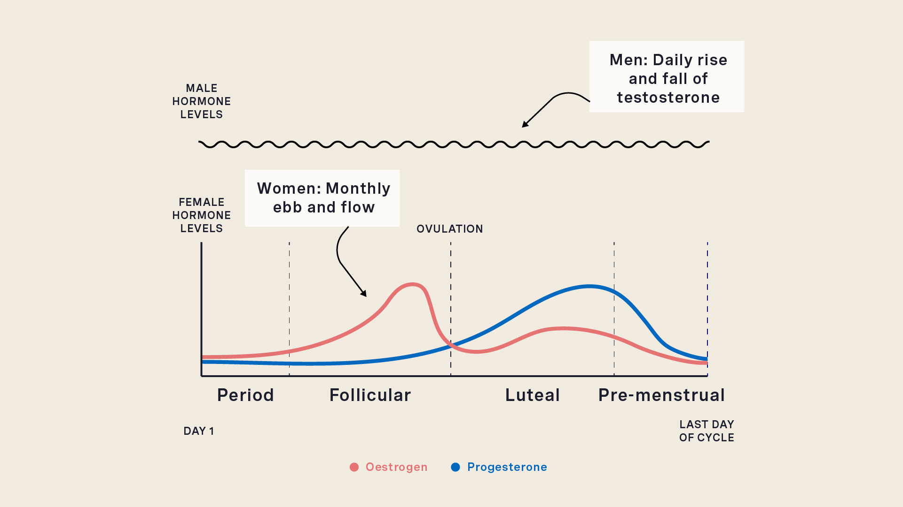
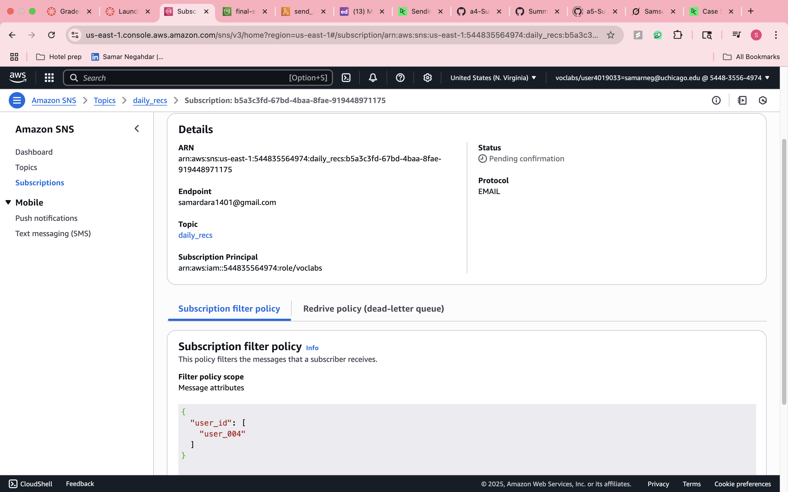
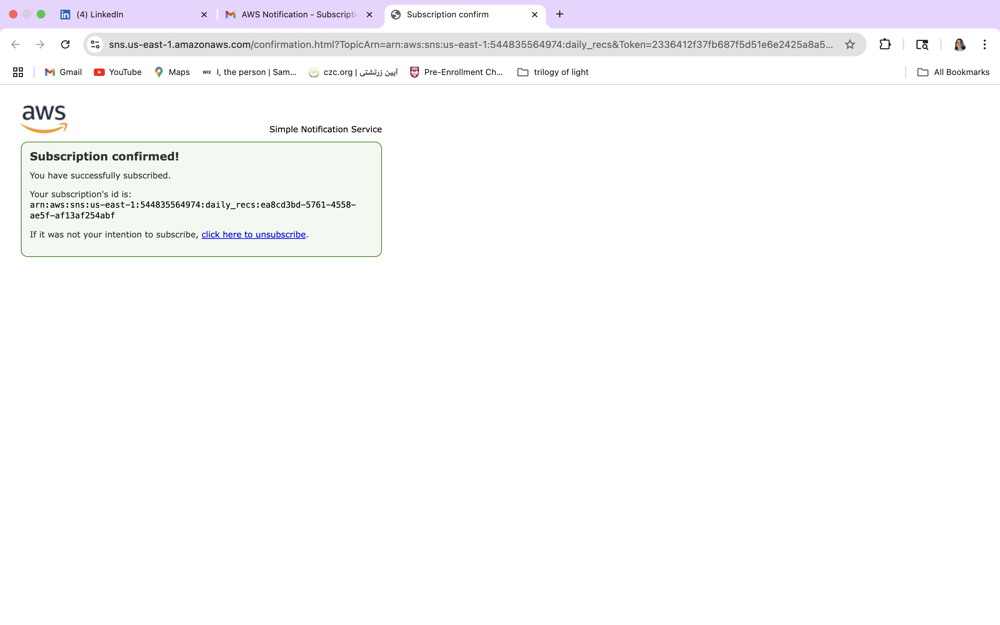
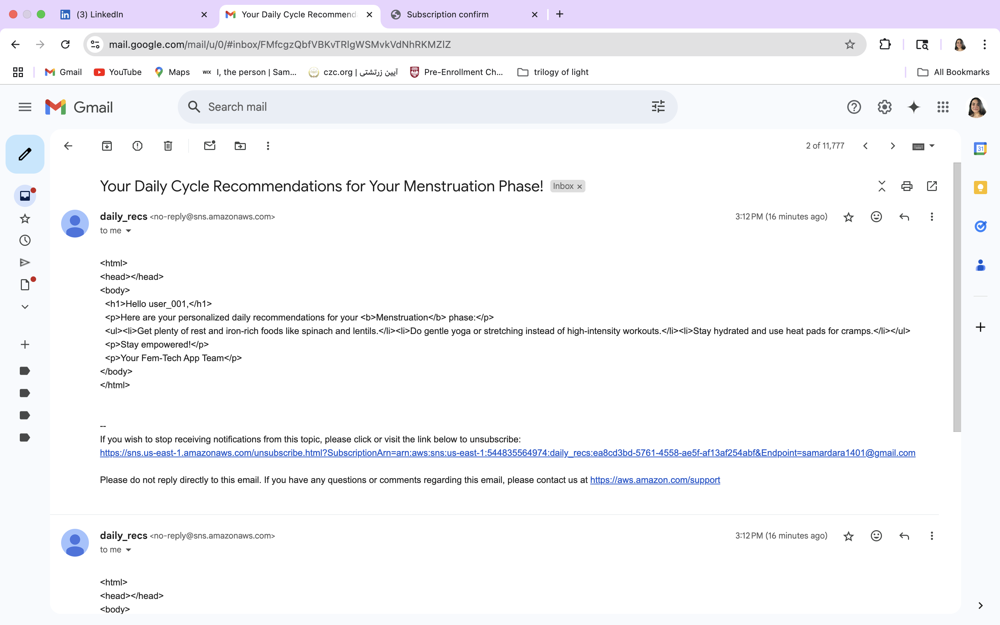
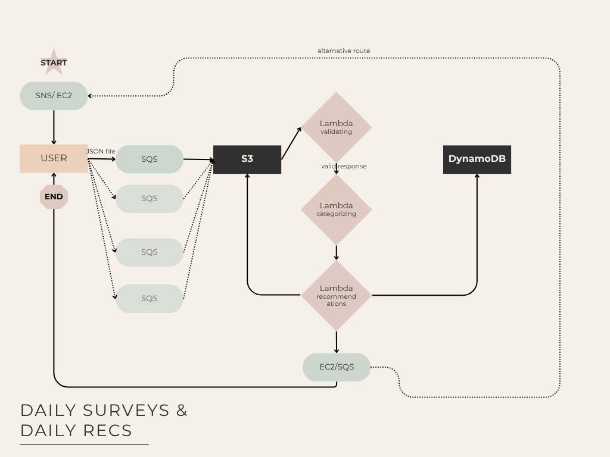

# MACS_Final

**Final Project for HPC Class**  
**Student: Summer Negahdar**

---

## 🎯 Project Topic  
**Designing a Pipeline for Daily Surveying, Hormonal Phase Categorization, and Personalized Recommendations**

---

## 🔍 Introduction

I am a founding team member of a fem-tech startup incubated at the University of Chicago Booth School of Business. Our application focuses on empowering women through personalized health insights aligned with their menstrual cycle phases.

Throughout the month, women experience natural hormonal fluctuations that affect not only physical health but also mood, focus, energy, appetite, and exercise performance. Our app aims to deliver **knowledge-based, cycle-specific** recommendations on:

- Diet & nutrition
- Exercise and activity
- Caffeine and alcohol intake
- Socialization patterns
- Mental focus and productivity

Understanding these shifts allows users to make more informed daily decisions, leading to better health and performance outcomes.

---

## 🚧 Current Stage

We are currently in the **early data collection phase**, aiming to assess how much women know about their cycles and how they feel throughout each phase. To support this effort, I have designed a cloud-based pipeline to:

1. Deliver daily surveys to beta users
2. Process and validate responses
3. Categorize each user into a hormonal phase
4. Deliver personalized recommendations

---

## 🧪 The Pipeline

The system consists of two main phases:

---

### 📤 Phase 1: Survey Distribution & Data Collection

Each day, a survey will be sent to users with the following six core questions:

---

**Q1: Do you currently have menstrual bleeding?**  
- 0 – No  
- 1 – Spotting  
- 2 – Light  
- 3 – Medium  
- 4 – Heavy  

---

**Q2: How would you rate your cervical mucus today?**  
- 0 – Dry  
- 1 – Sticky  
- 2 – Creamy  
- 3 – Watery  
- 4 – Egg-white consistency  

---

**Q3: How would you rate your sexual desire today?**  
- 1 – Very low  
- 2 – Low  
- 3 – Moderate  
- 4 – High  
- 5 – Very high  

---

**Q4: How would you describe your mood today?**  
- 1 – Very low / Irritable  
- 2 – Low  
- 3 – Neutral  
- 4 – Good  
- 5 – Very good / Emotionally balanced  

---

**Q5: Are you experiencing any of the following physical symptoms today?**  
_(Select all that apply)_  
- Cramps  
- Bloating  
- Breast tenderness  
- Feeling hot or flushed  
- Headache or migraine  
- Acne or skin breakouts  
- Lower back pain  
- Digestive issues (constipation, diarrhea)  
- Breast fullness or swelling  
- Nothing noticeable today  

**Additional: Describe any other physical symptoms you’re experiencing today:**  
`[ Text box input ]`

---

**Q6: How would you rate your energy level today?**  
- 1 – Very low  
- 2 – Low  
- 3 – Moderate  
- 4 – High  
- 5 – Very high  

---

> ✏️ _Note: These questions are representative samples for this project. Final content will be determined by the R&D team. for the purpose of this project however, I have come up with sample questions_

---

### ✅ Survey Validation

After receiving the survey data, the pipeline will:

- Check for response completeness
- Ensure the user spent a minimum threshold time (e.g., >5 seconds)

Once validated, the data is sent to a categorization Lambda function.

---

## 🧠 Phase Classification

The categorization Lambda determines which of the four menstrual cycle phases the user is in:

- **Menstruation**
- **Follicular**
- **Ovulation**
- **Luteal**

Each phase has a distinct hormonal profile and symptom pattern. The phase classification logic is encoded in a script (`lambda.py`) that maps survey response patterns (e.g., keywords, scores) to these phases.

Results are saved to:
- **DynamoDB Table** — updated daily for real-time access (only one table)

and then next lambda, the categorization lambda is invoked!

---
## 💡 Phase 2: Categorization Engine

in the second lambda, I will have the validated surveys processed, and categorized as a phase. the phase will also be added to the users based on the date and time and then the categorizaiton lambda will invoke the next lambda, which is the recommendation engine.
---

## 💡 Phase 3: Personalized Recommendation Engine

The third Lambda function generates daily, **phase-specific lifestyle recommendations**. These may include:

- Recommended food groups (e.g., magnesium-rich foods during luteal phase)
- Optimal exercise type and intensity (e.g., HIIT vs. yoga)
- Suggested caffeine/alcohol limits
- Social/mental activity suggestions
- Productivity strategies

These recommendations will evolve with ongoing data collection and may later incorporate ML-based personalization.
lastly, this lambda will trigger our last lambda, the email sending lambda. 

the results will then be saved in the DynamoDB table under the recommendations sub-folder.

---
## 💡 Phase 4: Sending emails Engine

before creating the lambda, I had to create a topic in the SNS section in my console and then used the Arn key to activate my SNS in my code. 

**I had to add policies so that only user 004 will be sent to my email**

this lambda will send the specific recs that we assigned to each user to the emails that has been submitted previously (user_email.JSON file). this would be the final step of our pipeline.

### IMPORTANT NOTE

If I want to send emails personalized to each user, it is best practiced with SES but since I did not have permission to use it, I had to use SNS and change settings manually in the console!

---
## ⚠️ Pipeline Flow Chart

this is how the pipeline should look in general. note that the dashed lines and the bubbles with less opacity are we can parallelize. (in SQS processing, the lambda processing)

**how to scale up if number of surveys increase?**

based on this flowchart there are a few ways we can do it. the first thing as pictured in the flowchart is increasing SQS queues. 

the majority of this pipeline consists of lambdas and lambdas are scalable on their own (changing the number of batches/lambda workers) 
so apart from the SQS batches that you can see in less opacity in the flowchart, the rest is pretty scalable as is!
---

## 📈 Future Enhancements

- Phase prediction refinement using time-series trends
- Adaptive learning from user feedback
- Cycle visualization dashboard with historical trends
- Expansion to accommodate users with PCOS or irregular cycles

---

## 🌐 Technologies Used

- **AWS Lambda** – for serverless execution of classification & recommendations
- **Amazon S3** – for storing user data and responses
- **Amazon DynamoDB** – for real-time phase tracking
- **Amazon SQS** – for queuing surveys before triggering processing
- **Amazon SNS** - for sending out recommendations to users
---
## Final Result:

I finally managed to put my own email as an end point and test that it all works. 

## 🔚 Summary

This project showcases the design and implementation of a practical, scalable data pipeline tailored for women's health tracking. By automating survey delivery, symptom processing, and phase-based personalization, we aim to close the knowledge gap and empower users with actionable daily insights — all using cloud-native infrastructure.

---
